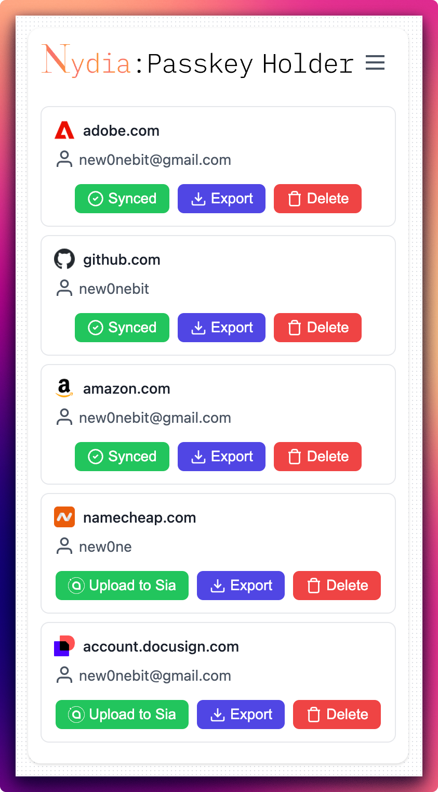
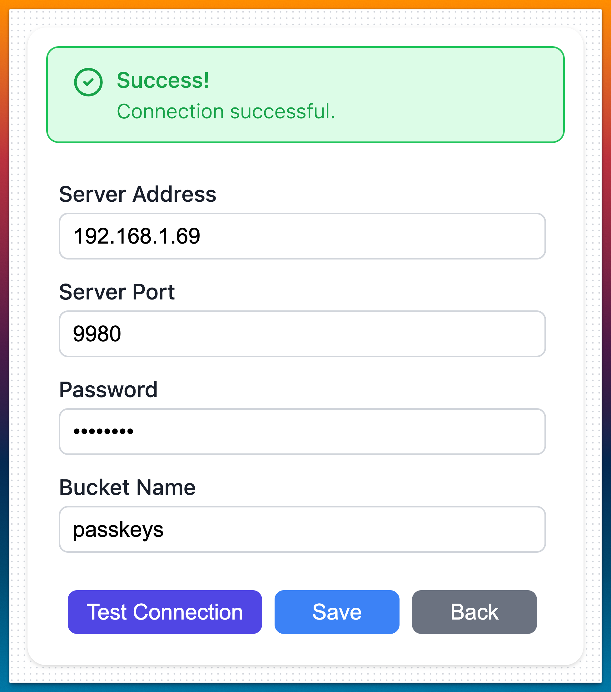

<h1 align="center">
  <picture>
    <source srcset=".docs/images/nydia-leaf-dark.svg" media="(prefers-color-scheme: light)" height="44px" alt="Nydia Logo">
      
  </picture>

<div align="center">

[](https://chrome.google.com/webstore/detail/)
[](https://addons.mozilla.org/firefox/addon/)
[](https://www.w3.org/TR/webauthn-3/)
[![Passkeys](https://img.shields.io/badge/Authentication-Passkeys-2EA44F?logo=data:image/svg+xml;base64,PHN2ZyB4bWxucz0iaHR0cDovL3d3dy53My5vcmcvMjAwMC9zdmciIHZpZXdCb3g9IjAgMCAzMiAzMiI+PHBhdGggZmlsbD0iI2ZmZmZmZiIgZD0iTTcgNS4yMWEuNzcuNzcgMCAwMS0uNDYtMS4zOEExNS40NiAxNS40NiAwIDAxMTYgMWMyLjY2IDAgNi40OC40NSA5LjUgMi42MmEuNzcuNzcgMCAwMS4xOCAxLjA3Ljc4Ljc4IDAgMDEtMS4wOC4xN0ExNSAxNSAwIDAwMTYgMi41MyAxNCAxNCAwIDAwNy41IDUuMDUuNzQuNzQgMCAwMTcgNS4yMXpNMjguMjMgMTIuMjZhLjc4Ljc4IDAgMDEtLjYzLS4zM0MyNS44NyA5LjQ5IDIyLjc4IDYuMjQgMTYgNi4yNGExNCAxNCAwIDAwLTExLjYzIDUuNy43Ny43NyAwIDAxLTEuMDcuMTcuNzYuNzYgMCAwMS0uMTUtMS4xMUExNS41NCAxNS41NCAwIDAxMTYgNC43MWM1LjYxIDAgOS44MSAyLjA4IDEyLjg0IDYuMzRhLjc3Ljc3IDAgMDEtLjE5IDEuMDcuNzkuNzkgMCAwMS0uNDIuMTR6TTEyLjI4IDMxYS43OC43OCAwIDAxLS43Mi0uNDkuNzUuNzUgMCAwMS40NC0xYzQuMzctMS42OCA3LTUuMTIgNy05LjIxYTIuOCAyLjggMCAwMC0zLTNjLTEuODYgMC0yLjc2IDEtMyAzLjM1YTQuMjcgNC4yNyAwIDAxLTQuNTIgMy44MyA0LjI3IDQuMjcgMCAwMS00LjMyLTQuNTlBMTEuNzEgMTEuNzEgMCAwMTE2IDguMzlhMTIgMTIgMCAwMTEyIDExLjkzIDE4LjY2IDE4LjY2IDAgMDEtMS4zOSA2LjUuNzguNzggMCAwMS0xIC40MS43Ni43NiAwIDAxLS40MS0xIDE3LjI1IDE3LjI1IDAgMDAxLjI3LTUuOTFBMTAuNDUgMTAuNDUgMCAwMDE2IDkuOTJhMTAuMTggMTAuMTggMCAwMC0xMC4zOCAxMCAyLjc3IDIuNzcgMCAwMDIuNzkgMy4wNiAyLjc0IDIuNzQgMCAwMDMtMi40OGMuMzYtMy4xMSAxLjg5LTQuNjkgNC41Ni00LjY5YTQuMzEgNC4zMSAwIDAxNC41MiA0LjU2YzAgNC43NC0zIDguNzItOCAxMC42M0EuOTIuOTIgMCAwMTEyLjI4IDMxek0xOS43NyAzMC4yOGEuODEuODEgMCAwMS0uNTItLjIuNzYuNzYgMCAwMTAtMS4wOCAxMi42MyAxMi42MyAwIDAwMy41NC04LjY4YzAtMS41Ni0uNDgtNi42NS02LjctNi42NWE2LjgzIDYuODMgMCAwMC00Ljk0IDEuODdBNi4xNyA2LjE3IDAgMDA5LjMyIDIwYS43Ny43NyAwIDAxLS43Ny43NmgwQS43Ni43NiAwIDAxNy43OCAyMCA3LjczIDcuNzMgMCAwMTEwIDE0LjQ2YTguMzQgOC4zNCAwIDAxNi0yLjMyYzYuMDggMCA4LjI0IDQuNCA4LjI0IDguMThBMTQuMDkgMTQuMDkgMCAwMTIwLjM0IDMwYS43NS43NSAwIDAxLS41Ny4yOHpNOC42NiAyNy43NGExNC4xNCAxNC4xNCAwIDAxLTEuNTYtLjA5Ljc2Ljc2IDAgMTEuMTctMS41MmMyLjQ5LjI4IDQuNDUtLjE2IDUuODQtMS4zMmE2LjM3IDYuMzcgMCAwMDIuMTItNC41My43NS43NSAwIDAxLjgyLS43MS43OC43OCAwIDAxLjcyLjgxQTcuODkgNy44OSAwIDAxMTQuMDkgMjYgOC4yIDguMiAwIDAxOC42NiAyNy43NHoiLz48L3N2Zz4=)](https://www.w3.org/TR/webauthn-3/) <br>
[![Sia](https://img.shields.io/badge/Storage-Sia%20Network-00C65E?logo=data:image/svg+xml;base64,PHN2ZyB4bWxucz0iaHR0cDovL3d3dy53My5vcmcvMjAwMC9zdmciIHZpZXdCb3g9IjAgMCA1MTIgNTEyIj48ZyBmaWxsPSIjRkZGRkZGIj48cGF0aCBkPSJNMzE2LjYgMjU2djYwLjZIMjU2Yy0zMy41IDAtNjAuNi0yNy4xLTYwLjYtNjAuNnMyNy4xLTYwLjYgNjAuNi02MC42IDYwLjYgMjcuMSA2MC42IDYwLjZtLTU5LjgtMTAxYy01NS44LTEuNy0xMDIuMyA0Mi4yLTEwNCA5Ny45LTEuNyA1NS44IDQyLjIgMTAyLjMgOTcuOSAxMDQgMS44LjEgMy41LjEgNS4zIDBoMTAxdi05OS43YzAtNTUuNi00NC41LTEwMS44LTEwMC4yLTEwMi4yIi8+PHBhdGggZD0iTTM5OC44IDExMy4yQzMyOS43IDQ0LjEgMjIzIDM1LjYgMTQ0LjYgODcuNWMyLjMgMi41IDQuMiA1LjMgNS44IDguMyA3NC40LTQ5LjEgMTc1LjgtNDAuOSAyNDEuMyAyNC41IDc0LjggNzQuOCA3NC44IDE5Ni41IDAgMjcxLjNzLTE5Ni41IDc0LjgtMjcxLjMgMGMtNjUuNS02NS41LTczLjYtMTY2LjgtMjQuNS0yNDEuMy0zLTEuNi01LjgtMy41LTguMy01LjgtNTIgNzguNC00My40IDE4NS4xIDI1LjcgMjU0LjIgNzguOSA3OC45IDIwNi43IDc4LjkgMjg1LjYgMHM3OC43LTIwNi42LS4xLTI4NS41Ii8+PHBhdGggZD0iTTEwMC40IDEwMC40YzcuOS03LjkgMjAuNy03LjkgMjguNiAwIDcuOSA3LjkgNy45IDIwLjcgMCAyOC42LTcuOSA3LjktMjAuNyA3LjktMjguNSAwLTgtOC04LTIwLjctLjEtMjguNiIvPjwvZz48L3N2Zz4=)](https://sia.tech/)
[](https://github.com/new0nebit/Nydia-Passkey-Holder/blob/main/LICENSE)

</div>
</h1>

<div align="center">
    
</div>
<br>
<p align="center">
  Nydia is a fast and lightweight browser extension for decentralized passkey storage on the <a href="https://sia.tech">Sia network</a>. 
  <br>
  Users can hold their passkeys locally with completely private decentralized backup.
</p>

## Installation

1. Clone the repository:
```bash
git clone https://github.com/new0nebit/Nydia-Passkey-Holder.git
```

2. Install dependencies:
```bash
npm install
```

3. Build the extension:
```bash
npm run build
```

4. This will create a build `extension` directory with unpacked extension for Chrome and Firefox browsers.

5. Load the extension in browser:
  - For Chrome:
    - Navigate to `chrome://extensions`
    - Enable "Developer mode"
    - Click "Load unpacked" and select the `extension/chrome` directory

  - For Firefox:
    - Navigate to `about:debugging#/runtime/this-firefox`
    - Click "Load Temporary Add-on"
    - Select any file from the `extension/firefox` directory

## Configuration

### Sia Renterd Setup

1. Install and configure `renterd` following the [official documentation](https://docs.sia.tech/renting/setting-up-renterd).
2. In the extension, configure your renterd settings:
    - Server Address
    - Server Port
    - Password
    - Bucket Name

<div align="center">
    
</div>

## Security Notes

- Passkeys are stored locally using browser encryption
- No passkey data is transmitted to third-party servers
- The extension requires minimal permissions