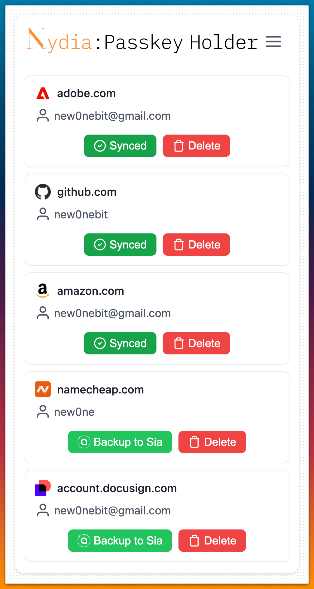

<h1 align="center">
  <picture>
    <source srcset=".docs/images/nydia-leaf-dark.svg" media="(prefers-color-scheme: light)" height="44px" alt="Nydia Logo">
    
  </picture>
</h1>

<div align="center">
    
</div>
<br>
<p align="center">
  Nydia is a fast and lightweight Chrome extension for decentralized passkey storage on the <a href="https://github.com/SiaFoundation">Sia network</a>. It allows users to handle their passkeys locally and store them on the Sia network.
</p>

## Installation

1. Clone the repository:
```bash
git clone https://github.com/new0nebit/Nydia-Passkey-Holder.git
```

2. Install dependencies:
```bash
npm install
```

3. Build the extension:
```bash
npm run build
```

4. This will create a build `extension` directory with unpacked extension for browser.

5. Load the extension in Chrome:
    - Open Chrome and navigate to `chrome://extensions`
    - Enable "Developer mode"
    - Click "Load unpacked" and select the `extension` directory

## Configuration

### Sia Renterd Setup

1. Install and configure `renterd` following the [official documentation](https://docs.sia.tech/renting/setting-up-renterd).
2. In the extension, configure your renterd settings:
    - Server Address
    - Server Port
    - Password
    - Bucket Name

<div align="center">
    
</div>

## Security Notes

- Passkeys are stored locally using browser encryption
- No passkey data is transmitted to third-party servers
- The extension requires minimal permissions